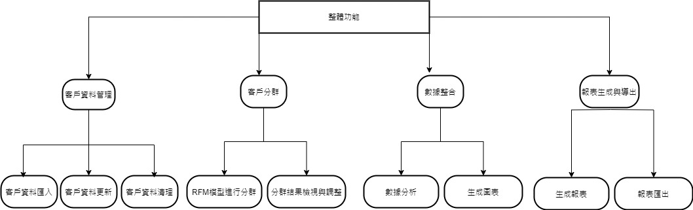

# group_HW3

## 功能性需求
### 客戶資料匯入與管理：
#### 支援多種格式資料匯入，能檢測並修正錯誤，允許資料更新與刪除。
### 客戶分群：
#### 基於RFM模型自動分群，支持自定義分群條件並視覺化展示結果。
### 報表生成與匯出：
#### 支援即時報表生成和PDF、Excel等格式的匯出，自定義報表內容。
## 非功能性需求
### 客戶資料匯入與管理：
#### 支援多種格式資料匯入，能檢測並修正錯誤，允許資料更新與刪除。
### 安全性需求：
#### 資料加密存儲與傳輸，支持多因素驗證與嚴格的訪問控制。
### 可用性需求：
#### 界面簡單易用，支持多語言，提供錯誤提示和解決方案。

## 功能性需求

## 使用案例圖

